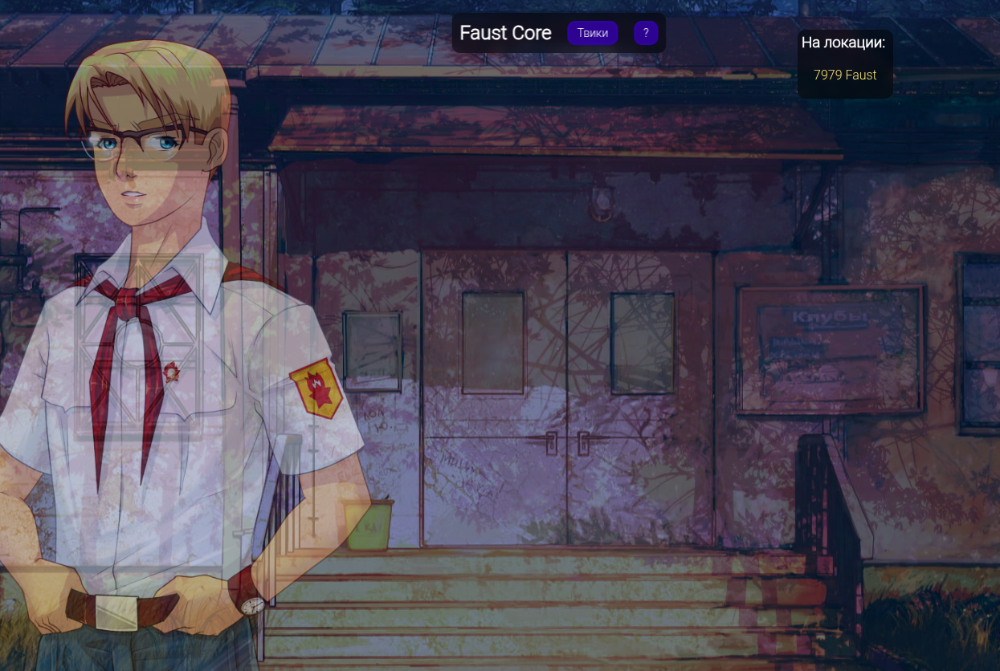

# Faust Core

Содержание:

- [Что это за мод](#что-за-мод-ядро)
- [Установка](#установка)
- [Предложить идею](#как-предложить-идею-для-твика)

Неофициальное мод-ядро для поддержки твиков проекта FaustProject на РП проекте [Everlasting Summer Online: Lost Alpha](https://esonline.su/). (Faust - отсылка на произведение).

Статус: в разработке.

## Что за мод-ядро?

Изначально это ядро было создано для двух целей:

1. Улучшение игрового процесса за счет добавления твиков, который игроки давно уже просят.
2. Добавление сюжетной линии.

Разработка сюжетной линии на данном этапе заморожена, но твики доступны для использования каждому.

## Установка

1. Для начала вам нужно установить расширение [tampermonkey](https://www.tampermonkey.net/).

2. После этого вы можете установить скрипт по [этой](https://greasyfork.org/en/scripts/527578-faustcore) ссылке нажав на кнопку `Install script`.

3. Вас перекинет в расширение tampermonkey, где нужно нажать `Install`.

Готово! Если вы сделали всё правильно, при заходе на сервер у вас появится меню FaustCore:

## Как предложить идею для твика

Отправьте мне идею любым удобным способом:

- Создав issue на github странице проекта.
- Написав на почту: <raik199x@mail.ru>
- Написав в discord: raik199x
